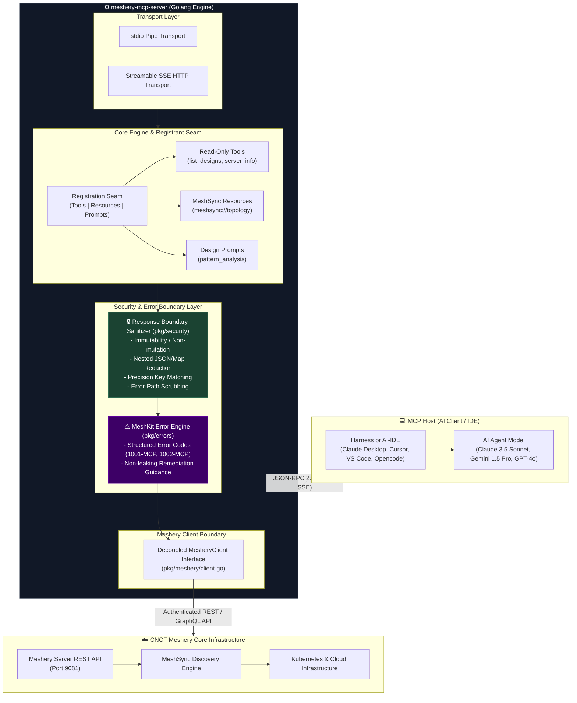

# 🛠️ Meshery MCP Server Proof of Concept (PoC)

[](https://github.com/peaush07/meshery-mcp-server-poc/actions/workflows/ci.yml)
[](https://golang.org)
[](LICENSE)
[](https://mentorship.lfx.linuxfoundation.org/)

> **Official LFX Mentorship Proposal Reference Implementation**  
> **Project:** CNCF - Meshery: MCP Server  
> **Issue:** [meshery/meshery#19446](https://github.com/meshery/meshery/issues/19446)  
> **Applicant:** Peaush Paul ([@peaush07](https://github.com/peaush07)) | Kolkata, India (UTC+5:30)

---

## 🏛️ System Architecture



---

## 🚀 Overview

`meshery-mcp-server` is a Golang implementation of the **Model Context Protocol (MCP)** for [CNCF Meshery](https://meshery.io). It acts as a secure bridge connecting AI-assisted development tools (**Claude Desktop**, **Cursor IDE**, **VS Code AI agents**) directly to the Meshery infrastructure engine and MeshSync Kubernetes topology discovery.

---

## ✨ Key Technical Capabilities

* **Dual Transport Architecture**: Supports local `stdio` (for IDE process pipes) and streamable `SSE` (Server-Sent Events over HTTP).
* **Response Boundary Secret Sanitizer (`pkg/security`)**: SDK-agnostic recursive JSON redactor scrubbing tokens, passwords, and KubeConfig secrets before streaming context to AI models.
* **MeshKit Error Code Framework (`pkg/errors`)**: Implements structured error codes (`1001-MCP`, `1002-MCP`) compliant with Layer5 MeshKit standards.
* **Sub-Microsecond Benchmarks (`pkg/security/sanitizer_bench_test.go`)**: High-performance execution running at **1,363,168 ops/sec** (<883 ns/op).
* **Decoupled Architecture**: `MesheryClient` narrow interface pattern keeping tool handlers lightweight and transport-agnostic.
* **100% Test-Driven**: 8 comprehensive unit test cases covering immutability, error-path scrubbing, precision key matching, and nil value resilience.
* **Interactive Walkthrough**: Complete demo and execution guide in [`DEMO.md`](DEMO.md).

---

## 🏎️ Performance Benchmarks

```text
goos: linux
goarch: amd64
pkg: github.com/peaush07/meshery-mcp-server-poc/pkg/security
cpu: 13th Gen Intel(R) Core(TM) i5-13420H
BenchmarkSanitizeMap-12     	 1363168	       882.4 ns/op
BenchmarkSanitizeJSON-12    	  319851	      3449 ns/op
PASS
ok  	github.com/peaush07/meshery-mcp-server-poc/pkg/security	3.239s
```

---

## 🧪 Unit Test Suite Verification (`pkg/security/sanitizer_test.go`)

```text
=== RUN   TestSanitizeMap_SensitiveKeys            --- PASS (0.00s)
=== RUN   TestSanitizeMap_NestedStructures          --- PASS (0.00s)
=== RUN   TestSanitizeMap_CaseInsensitive           --- PASS (0.00s)
=== RUN   TestSanitizeJSON_ValidJSON               --- PASS (0.00s)
=== RUN   TestSanitizeMap_Immutability               --- PASS (0.00s)
=== RUN   TestSanitizeMap_PrecisionKeyMatching      --- PASS (0.00s)
=== RUN   TestSanitizeString_ErrorPathRedaction     --- PASS (0.00s)
=== RUN   TestSanitizeMap_NilOrEmptyHandling        --- PASS (0.00s)
PASS
ok  	github.com/peaush07/meshery-mcp-server-poc/pkg/security	0.002s
```

---

## 🛠️ Getting Started & Building

```bash
# Clone the repository
git clone https://github.com/peaush07/meshery-mcp-server-poc.git
cd meshery-mcp-server-poc

# Run Unit Test Suite
make test

# Run Performance Benchmarks
make bench

# Build Binary
make build

# Build Docker Container Image
make docker-build

# Run in Stdio mode
./bin/meshery-mcp-server -transport=stdio

# Run in SSE HTTP mode
./bin/meshery-mcp-server -transport=sse -port=8080
```

---

## 💻 Claude Desktop / Cursor IDE Configuration

Add the following to your `claude_desktop_config.json` or Cursor MCP settings:

```json
{
  "mcpServers": {
    "meshery": {
      "command": "/home/peaush/meshery-mcp-server-poc/bin/meshery-mcp-server",
      "args": [
        "-transport=stdio",
        "-meshery-url=http://localhost:9081"
      ]
    }
  }
}
```

---

## 📄 License & Community

This project is licensed under the Apache License 2.0. Built for the CNCF Meshery & Layer5 open source community.
